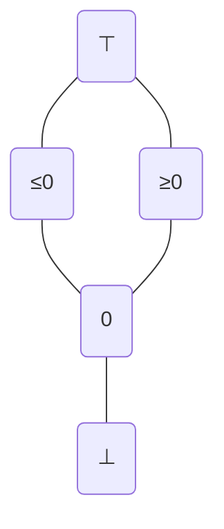
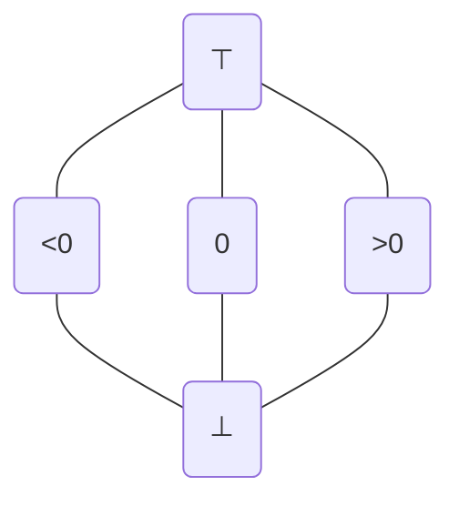
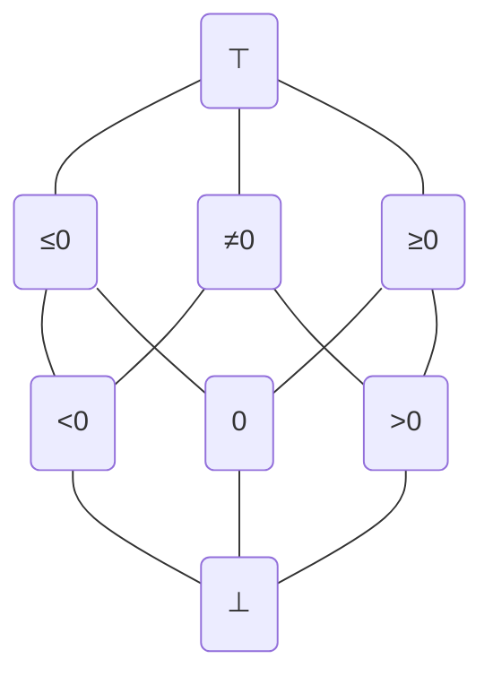
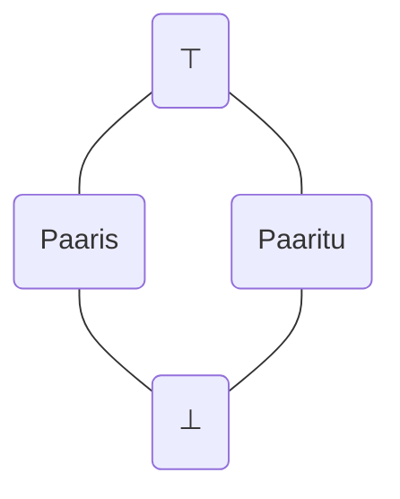
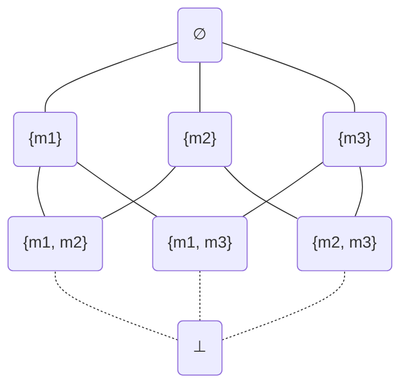

# Projektid
Suuremaks kodutööks ehk projektiks on ühe teema iseseisev kasutamine või edasi arendamine. Ülesande võib valida alltoodud nimekirjast või ise välja pakkuda.
Rangelt soovituslik on lisada automaattestid implementeeritud lahenduse testimiseks ja töö illustreerimiseks.

## Esitamine
Lisa oma implementatsioon ja testid sellesse samasse OCaml-i projekti. Paki projekti kaust kokku `.zip` failiks, aga **jäta välja `_opam` ja `_build` kaustad!** Esita kokkupakitud projekt Moodle'isse.

## Ideed
Iga idee juures on märgitud selle hinnanguline keerukus ja töömaht.
Ideede all on samuti ülevaatlikud juhised lahendamiseks, kuid need ei pruugi olla piisavalt täpsed.

Kui tekib küsimusi või soove täpsemate juhiste jaoks, siis küsi Zulip-is. Hea on seda teha süvenduspraktikumi kanalis, et vastata saaksid kõik õppejõud ja vastuseid näeksid kõik tudengid.

* [Mudelkontroll](#mudelkontroll)
   * [Mitmelõimelise algoritmi mudel ★☆☆☆☆](#mitmel%C3%B5imelise-algoritmi-mudel-)
   * [Parem mudelkontrollija ★★☆☆☆](#parem-mudelkontrollija-)
   * [Mudelkontroll interpretaatoriga ★★☆☆☆](#mudelkontroll-interpretaatoriga-)
   * [Sümboolne mudelkontroll ★★★★★](#s%C3%BCmboolne-mudelkontroll-)
* [Abstraktne interpretatsioon](#abstraktne-interpretatsioon)
   * [Täisarvude domeen](#t%C3%A4isarvude-domeen)
      * [Märgi domeen](#m%C3%A4rgi-domeen)
         * [Lihtne ★★☆☆☆](#lihtne-)
         * [Lame ★★☆☆☆](#lame-)
         * [Laiendatud ★★★☆☆](#laiendatud-)
      * [Paarsuse domeen ★☆☆☆☆](#paarsuse-domeen-)
      * [Kongruentsi domeen ★★★★☆](#kongruentsi-domeen-)
   * [Widening ★★★☆☆](#widening-)
      * [Narrowing ★★★★☆](#narrowing-)
   * [Protseduurid ★★★☆☆](#protseduurid-)
   * [Üldisem valvuriga kitsendamine ★★★★☆](#%C3%BCldisem-valvuriga-kitsendamine-)
   * [Lukkude analüüs ★★★☆☆](#lukkude-anal%C3%BC%C3%BCs-)
      * [Andmejooksude analüüs ★★★★☆](#andmejooksude-anal%C3%BC%C3%BCs-)
   * [Apron domeen ★★★★★](#apron-domeen-)
* [Hoare'i loogika](#hoarei-loogika)
   * [Nõrgima eeltingimuse täiendamine](#n%C3%B5rgima-eeltingimuse-t%C3%A4iendamine)
      * [`While` laused ★★☆☆☆](#while-laused-)
         * [Invariantidega annoteeritud `While` laused ★★★☆☆](#invariantidega-annoteeritud-while-laused-)
      * [`Rand` avaldised ★★★☆☆](#rand-avaldised-)
* [Võrrandisüsteemid](#v%C3%B5rrandis%C3%BCsteemid)
   * [Grammatikate võrrandisüsteemid ★★★☆☆](#grammatikate-v%C3%B5rrandis%C3%BCsteemid-)
      * [_FOLLOW_ võrrandisüsteem ★★★★☆](#follow-v%C3%B5rrandis%C3%BCsteem-)
   * [Võrrandisüsteemi solver](#v%C3%B5rrandis%C3%BCsteemi-solver)
      * [Round-robin ★☆☆☆☆](#round-robin-)
      * [Worklist ★★☆☆☆](#worklist-)
      * [Rekursiivne ★★★☆☆](#rekursiivne-)
      * [Top-down ★★★★☆](#top-down-)
      * [TDterm ★★★★★](#mathbftd_mathrmterm-)
* [Regulaaravaldised](#regulaaravaldised)
   * [Regulaaravaldiste ekvivalentsus ★★★☆☆](#regulaaravaldiste-ekvivalentsus-)
* [Muu](#muu)
   * [Lekser ja parser ★☆☆☆☆](#lekser-ja-parser-)
   * [Juhtvoograafi konstruktsioon ★★☆☆☆](#juhtvoograafi-konstruktsioon-)
   * [Visualisatsioon ★★★★☆](#visualisatsioon-)
   * [Goblint](#goblint)
      * [Märgi domeeni tutorial ★★☆☆☆](#m%C3%A4rgi-domeeni-tutorial-)
      * [_Taint_ analüüsi tutorial ★★★☆☆](#taint-anal%C3%BC%C3%BCsi-tutorial-)
      * [_Good first issue_ ★★★★☆](#good-first-issue-)

# Mudelkontroll

## Mitmelõimelise algoritmi mudel ★☆☆☆☆
Mitmelõimelistes programmides kasutatakse lukke (_mutex_-eid), et takistada mitmel lõimel samaaegselt kriitilisse sektsiooni siseneda. Tüüpiliselt on lukud jms olemas mingis standardses teegis, sest selleks vajalikud vastastikuse välistamise (_mutual exclusion_ ehk _mutex_) algoritmid on ebatriviaalsed.

[dekker]: https://en.wikipedia.org/wiki/Dekker%27s_algorithm
[peterson]: https://en.wikipedia.org/wiki/Peterson%27s_algorithm

Implementeeri [Dekker-i algoritmile][dekker] või [Peterson-i algoritmile][peterson] vastav mudelkontrolli mudel OCaml-i moodulina, et verifitseerida algoritmi korrektsus:

1. Mõtle välja, millest koosneb algoritmi kasutava mitmelõimelise süsteemi seisund (nt kahe lõime korral). Defineeri vastav OCaml-i tüüp.

   _Vihje: Enniku asemel võid uurida, kuidas OCaml-is record tüüpi defineerida._

2. Implementeeri `step` funktsioon, mis implementeerib mõlema lõime jaoks valitud algoritmi programmi ja võimaldab lõimedel suvaliselt vaheldumisi samme teha.

3. Implementeeri `is_error` funktsioon nõnda, et mõlema lõime samaaegne kriitilises sektsioonis olemine on viga.

4. Kontrolli mudelkontrollijaga implementeeritud mudelit. Kui algoritm on õigesti spetsifiseeritud, siis veaolukord ei tohiks olla võimalik.

## Parem mudelkontrollija ★★☆☆☆
Implementeerisime mudelkontrollija, mis püsipunkti ja sulundi abil arvutab välja kõik saavutatavad olekud ning seejärel kontrollib vea esinemist. See on üsna ebaefektiivne, sest mudelkontrolli võib lõpetada kohe, kui veaolek on saavutatud, mitte ei pea sealt edasi kõiki olekuid välja arvutama. Samuti oleks kasulik teada täpset olekute ahelat, mis veani viis.

Implementeeri parem mudelkontrollija, mis mõlemad probleemid lahendab:

1. Implementeeri mudelkontrollija `has_error` funktsioon otse, ilma `all_states` funktsiooni kasutamata. Kasuta efektiivset algoritmi, mis teeb samme vaid uute olekutega, mitte kõigi olekutega.

2. Üldista `has_error` funktsioon `find_error_trace` funktsiooniks, mis tagastaks veaolekuni viiva olekute ahela.

## Mudelkontroll interpretaatoriga ★★☆☆☆
Implementeerisime käsitsi konkreetsete programmide jaoks mudelkontrolli mudeleid. Käsitsi mudeli kirjutamise asemel võiks selle koostada automaatselt programmi AST-ist.

Implementeeri AST-iga ette antud programmide automaatne mudelkontrollija:

1. Implementeeri AST-i mitte-deterministlik interpretaator, mis ei kasuta oraaklit, vaid tagastab täisarvude/keskkondade hulga.

   _Vihje: Piisab funktsioonidest `eval_expr`, `eval_assign` ja `eval_guard`. Üldist `eval_stmt` funktsiooni pole vaja._

2. Implementeeri juhtvoograafi serva mitte-deterministlik interpretaator, st funktsioon `eval_edge`.

   _Vihje: Kasuta funktsioone eelmisest punktist._

3. Implementeeri mudelkontrolli mudeli moodul, mis võtab argumendiks juhtvoograafi.

   _Vihje: Kasuta funktsioone eelmisest punktist ja moodulist `Cfg`._

4. Kombineeri tükid tervikuks, mis teisendab AST-i juhtvoograafiks, loob eelmises punktis defineeritud funktori abil mudeli ja lõpuks käivitab sellel mudelkontrollija.

5. Testi lahendust, teisendades mõne käsitsi kontrollitud programmi koodi AST-iks.

## Sümboolne mudelkontroll ★★★★★
Sümboolne mudelkontroll kombineerib mudelkontrolli, sümboolse arvutamise ja automaatsed teoreemitõestajad. Konkreetsete väärtuste asemel on keskkonnas lihtsalt avaldised, millega iga muutuja väärtus on sisenditest arvutatud. Lisaks on igas seisundis _path constraint_, mis koosneb kõigist läbitud teele jäänud valvuritest. See on keerukam variant mitte-deterministliku interpretaatoriga mudelkontrollist.

Vt [A Survey of Symbolic Execution Techniques][symbolic-modelcheck], peatükk 1.

Implementeeri sümboolne mudelkontrollija:

1. Defineeri oleku tüüp, mis koosneb programmi punktist, sümboolsest keskkonnast ja _path constraint_-ist.

   _Vihje: Kasuta Z3 avaldisi._

2. Implementeeri juhtvoograafi serva sümboolne interpretaator, st funktsioon `eval_edge`.

   _Vihje: Kasuta funktsiooni `Symbolic.eval_expr`._

   _Vihje: `Guard` serva juures lisa path constraint ja kontrolli Z3 solveriga, kas kogu tee on üldse võimalik._

3. Implementeeri mudelkontrolli mudeli moodul, mis võtab argumendiks juhtvoograafi.

   _Vihje: Kasuta funktsioone eelmisest punktist ja moodulist `Cfg`._

4. Kombineeri tükid tervikuks, mis teisendab AST-i juhtvoograafiks, loob eelmises punktis defineeritud funktori abil mudeli ja lõpuks käivitab sellel mudelkontrollija.

5. Testi lahendust, teisendades mõne käsitsi kontrollitud programmi koodi AST-iks.

[symbolic-modelcheck]: https://doi.org/10.1145/3182657

# Abstraktne interpretatsioon

## Täisarvude domeen
Kasutasime täisarvulise muutuja võimalike väärtuste abstraheerimiseks erinevaid abstraktseid domeene: hulgad, konstandid ja intervallid. Lisaks on välja mõeldud domeene teistsuguste täisarvude omaduste analüüsiks.

Implementeeri abstraktse interpretaatori jaoks täiendav täisarvude domeen alltoodud valikust:

1. Implementeeri `IntDomain.S` liidesega moodul. Funktsioonis `eval_binary` ei pea kõiki juhte maksimaalse täpsusega implementeerima, vaid piisab operaatoritest, mis illustreerivad valitud domeeni kasulikkust.

2. Testi domeeni moodulit eraldiseisvalt.

3. Testi abstraktset interpretaatorit olemasolevate testidega, kuid kasutades lisatud täisarvude domeeni.

### Märgi domeen
Märgi domeenist on olemas erinevaid variatsioone.

[mine]: https://hal.sorbonne-universite.fr/hal-01657536/document
[spa]: https://cs.au.dk/~amoeller/spa/

Vt [Tutorial on Static Inference of Numeric Invariants by Abstract Interpretation][mine], peatükk 4.2.
Vt [Static Program Analysis][spa], peatükid 4.1, 5.1.

#### Lihtne ★★☆☆☆

#### Lame ★★☆☆☆

_Vihje: Kasuta `Domain.Flat` funktorit._

#### Laiendatud ★★★☆☆

_Vihje: Kasuta `SetDomain.Make` funktorit. Selle võre elemendid on vaadeldavad kui hulga_ $\\{<\mkern-3pt0, 0, >\mkern-3pt0\\}$ _alamhulgad._

### Paarsuse domeen ★☆☆☆☆
Paarsuse domeen on lihtne erijuht kongruentsi domeenist mooduli 2 järgi.

### Kongruentsi domeen ★★★★☆
Vt [Tutorial on Static Inference of Numeric Invariants by Abstract Interpretation][mine], peatükk 4.8.

## Widening ★★★☆☆
Meie implementeeritud abstraktne interpretaator teostab intervallanalüüsi, kuid mitte väga kasulikul kujul. For-tsükli keha analüüsitaks nii mitu korda kui tsükkel ise tööd teeb (vt [Jan Midtgaard-i slaidid][midtgaard], slaid 43) ja lõpmatu tsükli korral analüüs üldse ei termineeruks.

[midtgaard]: http://janmidtgaard.dk/aiws15/day1.pdf

Probleemi lahendamiseks kasutatakse _widening_ operaatoreid, mis kiirendavad püsipunkti arvutust täpsuse arvelt.

Vt [Compiler Design: Analysis and Transformation][seidl], peatükk 1.10.
Vt [Tutorial on Static Inference of Numeric Invariants by Abstract Interpretation][mine], peatükk 4.7.2.
Vt [Static Program Analysis][spa], peatükk 6.
Vt [Jan Midtgaard-i slaidid][midtgaard], slaid 44.

[seidl]: http://link.springer.com.ezproxy.utlib.ut.ee/book/10.1007/978-3-642-17548-0

Implementeeri abstraktses interpretaatoris _widening_:

1. Lisa abstraktse domeeni liidesesse `widen` funktsioon. Implementeeri see kõigis vajalikes domeenides.

   _Vihje: Intervallide lõpmatuste asemel saab kasutada `min_int` ja `max_int`, kuid see vajab `eval_binary` funktsioonis erikäsitlust, et_ $[0, \infty] + [1, 1]$ _oleks_ $[1, \infty]$, _mitte_ $[1, -\infty]$.

   _Vihje: `MapDomain` jms peavad rakendama oma sisemistel elementidel seda `widen` operaatorit sarnaselt `join`-iga._

   _Vihje: Mittevajalikes domeenides võib kasutada lihtsalt `failwith "unsupported"` vms._

2. Implementeeri püsipunkti arvutaja, mis rakendab `widen` funktsiooni igal sammul. Kasuta seda püsipunkti arvutajat abstraktses interpretaatoris.

3. Kontrolli, kas abstraktne intervallanalüüsiga interpretaator saab hakkama lõpmatute tsüklidega.

### Narrowing ★★★★☆
_Widening_-u tõttu kaotatud täpsust õnnestub teatud juhtudel taastada kasutades _narrowing_ operaatorit.

Vt [Compiler Design: Analysis and Transformation][seidl], peatükk 1.10.
Vt [Tutorial on Static Inference of Numeric Invariants by Abstract Interpretation][mine], peatükk 4.5.
Vt [Static Program Analysis][spa], peatükk 6.2.
Vt [Jan Midtgaard-i slaidid][midtgaard], slaid 46.

Täiendava ülesandena võib implementeerida abstraktses interpretaatoris _narrowing_-u:

1. Analoogiliselt lisa `narrow` funktsioon.

2. Täienda püsipunkti arvutajat, et pärast _widening_ iteratsioone tehtaks _narrowing_ iteratsioonid.

3. Kontrolli, et abstraktne intervallanalüüsiga interpretaator leiab täpse tulemuse for-tsükli laadses programmis.

## Protseduurid ★★★☆☆
Implementeerisime abstraktse interpretaatori, mis on _intraprotseduraalne_ ehk ei sisalda protseduuride/funktsioonide väljakutseid.

Vt [Compiler Design: Analysis and Transformation][seidl], peatükk 2.1, 2.5-2.6.

Implementeeri abstraktne interpretaator, mis on _interprotseduraalne_ ehk toetab ka protseduuride/funktsioonide väljakutseid:

1. Lisa AST-i lihtsa protseduurikutse lausete tüüp, mis võimaldaks lauseid stiilis `f()`.

   _Vihje: Lihtsuse mõttes pole vaja protseduuride argumente ja tagastusväärtust, sest neid saab simuleerida globaalsete muutujatega. Näiteks enne protseduuri kutsumist võib vajalikud argumendid omistada muutujatesse `a1`, `a2`, jne., et neid protseduuri sees lugeda. Protseduuri sees võib tagastusväärtuse omistada muutujasse `return`, et seda peale protseduuri kutset lugeda._

2. Defineeri programmi andmetüüp kui _map_, mille võtmed on protseduuride nimed ja väärtused on AST-i laused.

   _Vihje: Kokkuleppeliselt võib programmi alguspunktiks kasutada protseduuri nimega `main`._

3. Täienda abstraktset interpretaatori `eval_stmt` funktsiooni lisatud lausetüübiga.

   _Vihje: Lisa täiendav programmi andmetüüpi argument, et saaks protseduurikutseid interpreteerida._

4. Lisa abstraktsesse interpretaatorisse `eval_program` funktsioon, mis alustab programmi interpreteerimist kokkulepitud algprotseduurist.

_PS. Võid esialgu protseduurikutsete toe implementeerida konkreetses interpretaatoris. See on täiesti analoogiline ülaltoodud kirjeldusele. Seejärel saad täiendused minimaalsete muudatustega kopeerida konkreetsest interpretaatorist abstraktsesse._

## Üldisem valvuriga kitsendamine ★★★★☆
Abstraktses interpretaatoris implementeerisime `eval_guard` funktsiooni väga konkreetsete juhtude jaoks. Seda saab teha _natuke_ üldisemalt (aga mitte täiesti üldiselt!).

Vt [Tutorial on Static Inference of Numeric Invariants by Abstract Interpretation][mine], peatükk 4.6.

Implementeeri see edasi-tagasi puu struktuuri järgiv algoritm ja kasuta seda `eval_guard` funktsioonis.

## Lukkude analüüs ★★★☆☆
Käsitlesime mitmelõimeliste programmide vigade ja analüüsimise teemat teoreetiliselt, kuid ei implementeerinud neist midagi.

Implementeeri lukkude analüüs:

1. Lisa AST-i laused luku võtmiseks ja vabastamiseks, mis võimaldaksid lauseid stiilis `lock(m)` ja `unlock(m)`.

2. Defineeri lukuhulkade domeen. See on alamhulkade domeen, mille elementideks on lukkude nimed. Lisaks on võre järjestus tavalise alamhulkade domeeniga võrreldes ümberpööratud, st ${\sqsubset} = {\supseteq}$ ja ${\sqcup} = {\cap}$, sest kahe haru kohtumisel jäävad alles ainult need lukud, mis olid olemas mõlemas harus. Samuti tuleb lisada fiktiivne $\bot$ element, mis tähistab universaalhulka.

3. Defineeri uus abstraktne interpretaator, kus abstraktse väärtuskeskkonna asemel arvutatakse lukuhulki.

   _Vihje: Lihtsuse mõttes võib täielikult ignoreerida avaldisi ja nende abstraktset väärtustamist._

### Andmejooksude analüüs ★★★★☆
Lukkude analüüs iseenesest pole ülemäära kasulik, kuid see on ehitusklotsiks andmejooksude analüüsi implementeerimiseks.

Implementeeri andmejooksude analüüs:

1. Defineeri mitmelõimelise programmi andmetüüp kui AST-i lausete list. Iga lause vastab ühele paralleelselt jooksvale lõimele.

2. Lisa lukkude analüüsi abstraktsesse interpretaatorisse `eval_program` funktsioon, mis interpreteerib kõigi lõimede laused.

3. Lisa globaalne OCaml-i andmestruktuur, kuhu saaks koguda kõik muutujate ligipääsud, mis on kolmikud (muutuja nimi, lugemine/kirjutamine, lukuhulk).

4. Täienda abstraktset interpretaatorit nii, et iga muutuja ligipääsu juures lisataks sinna andmestruktuuri vastav element. Kirjutamised toimuvad omistamistes ja lugemised kõigis avaldistes.

   _Vihje: Lugemiste kogumiseks on taaskord vaja `eval_expr` funktsiooni, kuid väärtustamise asemel tuleb lihtsalt kogu avaldis läbi käia, et leida selles kõik muutujate kasutused._

5. Täienda `eval_program` funktsiooni nii, et pärast lõimede interpreteerimist kontrollitakse, kas kogutud muutujate ligipääsude hulgas on kaks sellist, mille vahel võib toimuda andmejooks.

## Apron domeen ★★★★★
Implementeerisime abstraktse interpretaatori, mis on mitte-relatsionaalne, st keskkonna domeenis jälgitakse iga muutuja abstraktset väärtust teistest muutujatest täiesti sõltumatult. Programmides esineb ka keerukamaid seoseid muutujate vahel ja nende analüüsiks kasutatakse relatsionaalseid domeene, kuid nende implementeerimine on väga suur töö.

Vt [Tutorial on Static Inference of Numeric Invariants by Abstract Interpretation][mine], peatükk 5.

Implementeeri abstraktse interpretaatori keskkondade domeen, mis kasutab [Apron][apron] teeki:

1. Paigalda Apron: `opam install apron`.

2. Implementeeri meie liideses abstraktne domeen, mis sisemiselt kasutab Apron-it. Võid kasutada näiteks octagon domeeni.

   _Vihje: [Apron-i OCaml-i API dokumentatsioon][apron-ocaml]._

3. Implementeeri abstraktne interpretaator, mis kasutab `MapDomain` keskkonna asemel eelnevalt implementeeritud relatsionaalset domeeni.

4. Testi abstraktset interpretaatorit programmidel, kus esinevad sellised mitme muutujaga seosed.

[apron]: https://antoinemine.github.io/Apron/doc/
[apron-github]: https://github.com/antoinemine/apron
[apron-ocaml]: https://antoinemine.github.io/Apron/doc/api/ocaml/index.html

# Hoare'i loogika

## Nõrgima eeltingimuse täiendamine
Implementeerisime automaatse nõrgima eeltingimuse arvutamise, kuid jätsime lihtsuse mõttes toetamata mõned AST-i konstruktsioonid.

Implementeerida vähemalt üks alltoodud kahest täiendusest.

### `While` laused ★★☆☆☆
Üldine `While` lausete tugi vajab, et kasutaja annaks tsüklite jaoks invariandid, mille kehtivust saab siis automaatselt kontrollida.

Implementeeri tsükli invariantide tugi:

1. Lisa `wp` funktsioonile oraakli-tüüpi argument, mis võimaldab väljastpoolt kasutajal iga tsükli jaoks invariandi anda.

   _Vihje: Invariantide oraakli tüüp võib näiteks olla `Ast.stmt -> Ast.expr`._

2. Implementeeri üldine `While` lausete juht `wp` funktsioonis.

3. Testi oma lahendust mõne tsüklit sisaldava programmi verifitseerimisega.

#### Invariantidega annoteeritud `While` laused ★★★☆☆
Alternatiiv inveriantide oraaklile on muuta AST-i nii, et igal `While` lausel on ka kolmas komponent: tsükli invariant. Nii moodustub programmeerimiskeel, kus programmeerija peab programmi kirjutades juba invariandid määrama.

Täiendava ülesandena võib implementeerida sellise keele muutes olemasolevat AST-i või defineerides uue annoteeritud programmide AST-i.

### `Rand` avaldised ★★★☆☆
`Rand` avaldiste tugi vajab keerukamat `Symbolic.eval_expr` funktsiooni, mis lisaks AST-i avaldise teisendamisele Z3 avaldiseks tagastab ka lisatingimuse. Avaldis `Rand (l, u)` tuleb teisendada näiteks Z3 muutuja `rand_i`, kus `i` on unikaalne arv, ja tagatada lisatingimus `l <= rand_i && rand_i <= u`.

Implementeeeri `Rand` avaldiste tugi:

1. Muuda `eval_expr` tagastustüüp, et funktsioon tagastaks kaks Z3 avaldist. Adapteeri ülejäänud kood vastavaks muudetud funktsiooni tüübile.

2. Implementeeri ülalkirjeldatud `Rand` avaldise juht funktsioonis `eval_expr`.

3. Veendu, et `eval_expr` ja `wp` funktsioonid korrektselt kasutaks ka tagastatud lisatingimust. Vastasel juhul on iga `rand_i` muutuja täiesti vaba ja programmi verifitseerimisel ekslikult ei arvestata vahemiku lubatud piiridega.

4. Täienda `check` funktsiooni, et vigase programmi korral tagastataks lisaks viga esile toovale keskkonnale ka viga esile toov oraakel. Kui need anda `Eval.Concrete.eval_stmt` argumentideks, siis peaks analüüsitud programm päriselt jõudma veani.

# Võrrandisüsteemid

## Grammatikate võrrandisüsteemid ★★★☆☆
Implementeerisime käsitsi konkreetsete grammatikate jaoks _Nullable_ ja _FIRST_ arvutamise võrrandisüsteeme. Käsitsi võrrandisüsteemi kirjutamise asemel võiks selle koostada automaatselt grammatika enda definitsioonist.

Implementeeri automaatne grammatikate _Nullable_ ja _FIRST_ arvutaja:

1. Mõtle välja, kuidas esitada OCaml-is grammatikat ja selle kõiki osi (terminalsümbolid, mitteterminalid, produktsioonireeglite paremad pooled). Defineeri vastavad OCaml-i tüübid.

2. Defineeri oma andmetüüpidega mõned näidisgrammatikad (nt need samad, millele käsitsi võrrandisüsteeme koostasime), et veenduda oma tüüpide sobivuses.

3. Implementeeri _Nullable_ võrrandisüsteemi moodul, mis võtab argumendiks grammatika.

4. Implementeeri _FIRST_  võrrandisüsteemi moodul, mis võtab argumendiks grammatika ja talle vastava _Nullable_ võrrandisüsteemi lahendi.

5. Testi lahendust, arvutades oma võrrandisüsteemi funktoritega välja ülaldefineeritud näidisgrammatikate _Nullable_ ja _FIRST_.

### _FOLLOW_ võrrandisüsteem ★★★★☆
Grammatika _FOLLOW_ hulgad saab välja arvutada, kui on teada tema _Nullable_ ja _FIRST_. Kuna _FOLLOW_ pole defineeritud otseste võrdustega, vaid kombineeritakse hulkade võrratustest, siis peab vahesammuna kombineerima need võrratused võrranditeks, et saaks rakendada meie solvereid.

Täiendava ülesandena võib implementeerida _FOLLOW_ võrrandisüsteemi mooduli, mis võtab argumendiks grammatika ning talle vastavad _Nullable_ ja _FIRST_ võrrandisüsteemide lahendid.

## Võrrandisüsteemi solver
Kasutasime võrede võrrandisüsteemide lahendamiseks ühte lihtsat solverit: Kleene iteratsiooniga. Nagu arvata võib, pole see kuigi efektiivne.

Implementeeri võrede võrrandisüsteemide täiendav solver alltoodud valikust:

1. Implementeeri uus solver-i moodul.

   _Vihje: Uuri OCaml-is imperatiivselt programmeerimist, sest seda läheb vaja._

2. Testi abstraktset interpretaatorit olemasolevate testidega, kuid kasutades lisatud solverit.

### Round-robin ★☆☆☆☆
See solver on Kleene itereerimise optimeering, mis väärtustab võrrandeid ükshaaval, mitte kõiki korraga.

Vt [Compiler Design: Analysis and Transformation][seidl], peatükk 1.5.

_Vihje: `Constraint.Solver` moodulis on `RoundRobin` mooduli mall juba antud._

### Worklist ★★☆☆☆
See solver on _round-robin_ itereerimise optimeering, mis kasutab ära muutujatevahelisi sõltuvusi.

Vt [Compiler Design: Analysis and Transformation][seidl], peatükk 1.12.

_Vihje: Lisa võrrandisüsteemi liidesesse `infl` funktsioon, et seda solveris kasutada ja täienda abstraktse interpretaatori võrrandisüsteemi._

### Rekursiivne ★★★☆☆
See solver tuvastab muutujatevahelised sõltuvused automaatselt, et neid ei peaks võrrandisüsteemi defineerimisel eraldi spetsifitseerima.

Vt [Compiler Design: Analysis and Transformation][seidl], peatükk 1.12.

### Top-down ★★★★☆
See solver on rekursiivse solveri veelgi täiendatud versioon.

Vt [Three improvements to the top-down solver][td3], lisa A.

[td3]: https://doi.org/10.1017/S0960129521000499

### $\mathbf{TD}_{\mathrm{term}}$ ★★★★★
See solver kombineerib top-down solveri ja _widening_-u.

Vt [Three improvements to the top-down solver][td3], peatükk 4.

# Regulaaravaldised

## Regulaaravaldiste ekvivalentsus ★★★☆☆
Kasutasime Brzozowski tuletisi, et sobitada sõnesid regulaaravaldistega, ilma et kasutada vahepealse esitusena lõplikke automaate. Lisaks vaatasime regulaaravaldiste lihtsustamist.
Need saab elegantselt kombineerida regulaaravaldiste ekvivalentsuse kontrollimiseks, jällegi ilma lõplikke automaate kasutamata.

Vt [Proof Pearl: Regular Expression Equivalence and Relation Algebra][rexp].

Implementeeri regulaaravaldiste ekvivalentsuse kontrollija:

1. Implementeeri regulaaravaldiste normaalkujule viimise funktsioon `norm`.

2. Implementeeri regulaaravaldiste tuletiste võtmise funktsioon `derive`, mis garanteerib normaalkujul tulemuse.

3. Implementeeri regulaaravaldises sisalduvate sümbolite leidmise funktsioon `atoms`.

4. Kasutades neid funktsioone, implementeeri kahe regulaaravaldise ekvivalentsuse kontrollija.

   _Vihje: [Artiklis][rexp] on seda tehtud funktsioonidega `test`, `step`, `closure` ja `check-eqv`._

5. Kasutades ekvivalentsuse kontrollijat, implementeeri funktsioon, mis kontrollib, kas ühe regulaaravaldise keel sisaldub teises.

   _Vihje: Lahendus on üherealine._

6. Testi mõlemat kontrollijat.

[rexp]: https://www21.in.tum.de/~krauss/papers/rexp.pdf

# Muu

## Lekser ja parser ★☆☆☆☆
[`lex`][lex] ja [`yacc`][yacc] on klassikalised lekserite ja parserite kirjutamise tööriistad. OCaml-il on neile vastavad oma `ocamllex` ja `ocamlyacc`.

[lex]: https://en.wikipedia.org/wiki/Lex_(software)
[yacc]: https://en.wikipedia.org/wiki/Yacc
[menhir]: http://gallium.inria.fr/~fpottier/menhir/

Implementeeri lekser ja parser, mille tulemuseks oleks meie AST. `ocamlyacc`-i asemel võid kasutada ka moodsamat ja võimsamat [Menhir][menhir]-it.

Vt [Lexer and parser generators (ocamllex, ocamlyacc)][lexyacc].
Vt [Real World OCaml, peatükk Parsing with OCamllex and Menhir][rwo-lexmenhir].

[lexyacc]: https://v2.ocaml.org/manual/lexyacc.html
[rwo-lexmenhir]: https://dev.realworldocaml.org/parsing-with-ocamllex-and-menhir.html

_Vihje: `Regex.parse` on meil selliselt juba implementeeritud._

## Juhtvoograafi konstruktsioon ★★☆☆☆
Võrrandisüsteemidega abstraktseks interpretatsiooniks teisendasime AST-i juhtvoograafiks (ja sama tehtaks ka ülaltoodud mudelkontrolli projektides). Etteantud teisendus pole aga optimaalne ning sisaldab palju ebavajalikke tippe ja `Nop` servi.

Implementeeri AST-i teisendus juhtvoograafiks, mis loob võimalikult lihtsa ja kompaktse (ent siiski korrektse!) juhtvoograafi. Parimal juhul pole ühtegi `Nop` serva vaja!

## Visualisatsioon ★★★★☆
Implementeerisime erinevaid programmianalüüsi meetodeid ja käivitasime neid testides, kuid nendega ei saa mugavalt eksperimenteerida ja (vahe)tulemusi ilusti näha. Oleks hea, kui saaks neid meetodeid interaktiivselt kasutada ja tööpõhimõtteid visuaalselt näha.

Implementeeri ühe käsitletud meetodi jaoks interaktiivne kasutajaliides, mis jookseb veebibrauseris. Kasutades [js_of_ocaml][jsoo]-it saab olemasoleva OCaml koodi kompileerida JavaScript-iks, et seda brauseris jooksutada. Sellele saab lisada OCaml-is kirjutatud loogika, mis manipuleerib brauseris HTML-i ja CSS-iga. Soovi korral võib proovida ka [jsoo-react][jsoo-react]-i kasutada.

Vt [JavaScript Compilation With Js_of_ocaml][jsoo-dune].

[jsoo]: https://ocsigen.org/js_of_ocaml/latest/manual/overview
[jsoo-dune]: https://dune.readthedocs.io/en/latest/jsoo.html
[jsoo-react]: https://ml-in-barcelona.github.io/jsoo-react/

## Goblint
[Goblint][goblint] on meie arendatav staatiline programmianalüsaator, mis on implementeeritud OCaml-is. Selle peal saab kogeda, kuidas käib päris analüsaatori arendus.

Paigalda Goblint arenduseks ja lahenda üks alltoodud ülesannetest.

[goblint]: https://goblint.in.tum.de/

### Märgi domeeni tutorial ★★☆☆☆
Siin implementeeritakse ülaltoodud märgi domeeni projekt Goblint-is.

Vt [Your first analysis - Goblint documentation][goblint-signs]. Lahendama peaks ka "Extending the domain" osa.

[goblint-signs]: https://goblint.readthedocs.io/en/latest/developer-guide/firstanalysis/

### _Taint_ analüüsi tutorial ★★★☆☆
Siin implementeeritakse Goblint-is lihtne _taint_ analüüs, mis kontrollib, kas ebausaldusväärne kasutaja sisend võib programmis esile tuua SQL _injection_-i vms.

Vt [GobTaint: A Taint Analysis for the Static Analyzer Goblint][goblint-taint-slides].
Vt [Taint checking][taint].
Vt [Static Program Analysis][spa], peatükk 9.1.

[goblint-taint-slides]: https://github.com/goblint/analyzer/files/8569680/slides_Schwarz_Tilscher_Erhard_GoblintWorkshop.pdf
[goblint-taint]: https://github.com/goblint/analyzer/blob/master/src/analyses/tutorials/taint.ml
[taint]: https://en.wikipedia.org/wiki/Taint_checking

### _Good first issue_ ★★★★☆
Tutorialite lahendamise asemel (või täienduseks) võib Goblint-it isegi päriselt arendada.

Lahenda mõni [lihtne Goblint-i _issue_][goblint-good-first-issue] ja tee _pull request_.
Konsulteeri _issue_ valimisel aine õppejõududega.

[goblint-good-first-issue]: https://github.com/goblint/analyzer/issues?q=is%3Aissue+is%3Aopen+label%3A%22good+first+issue%22
